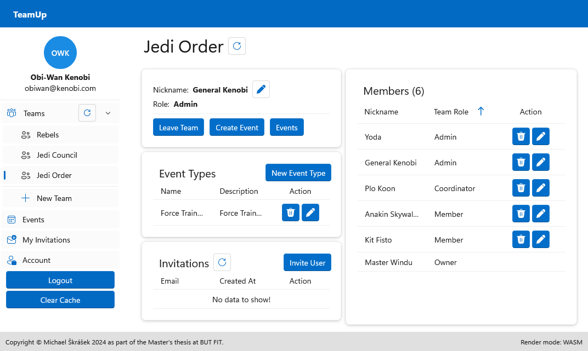
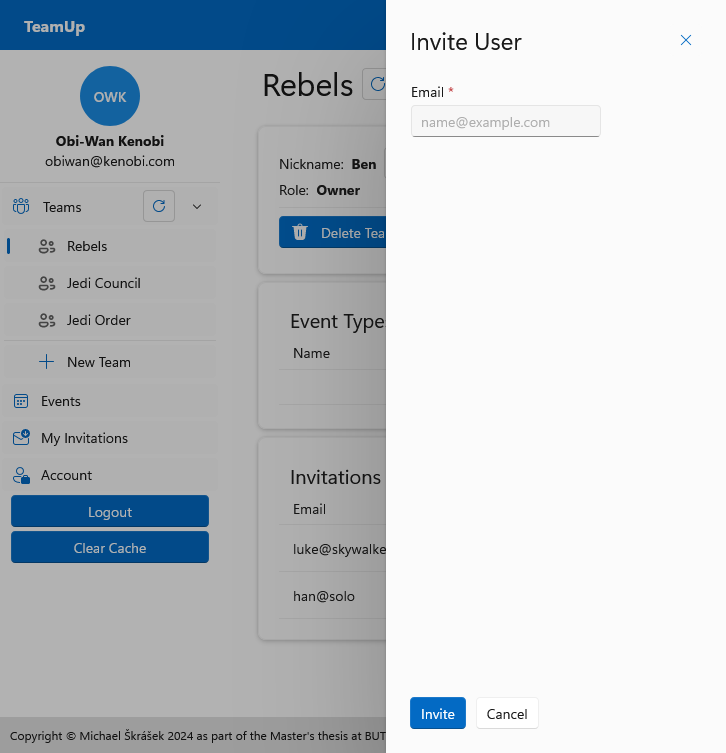
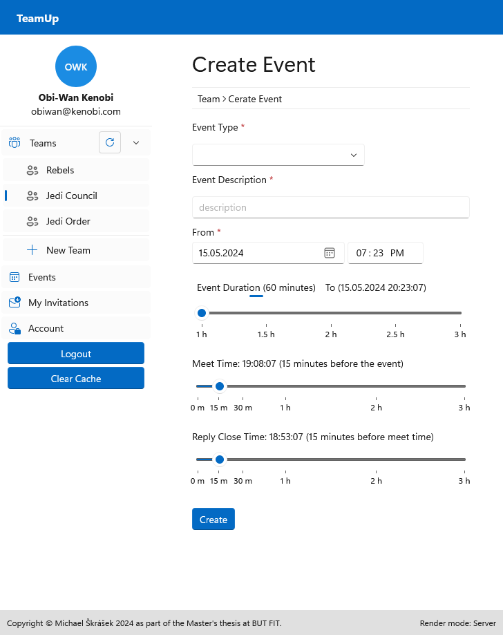
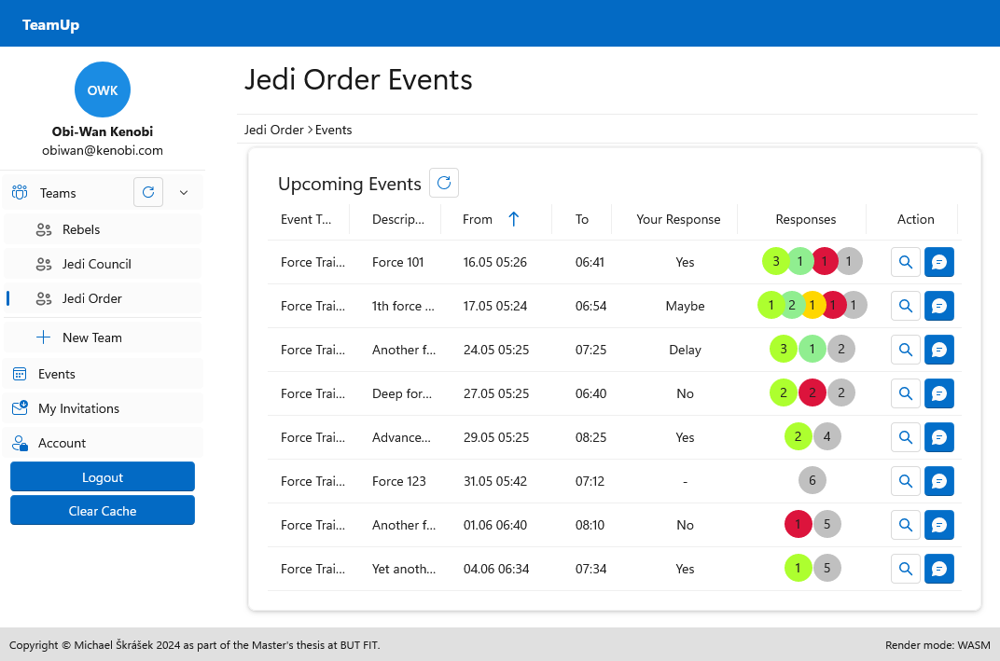
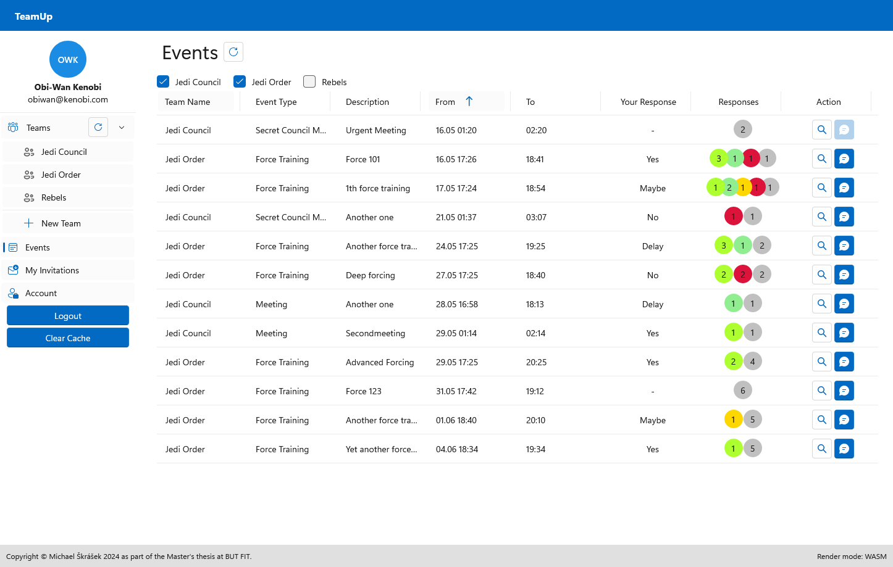
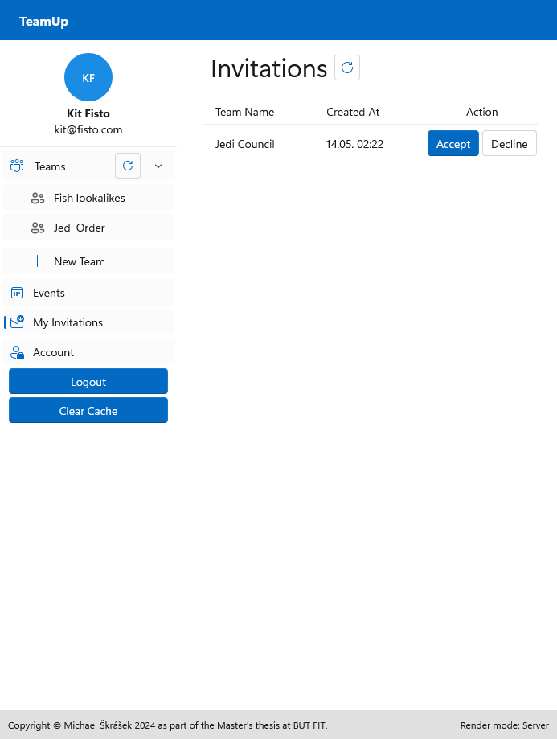

# Blazor Frontend

This is frontend application for a demonstration application "TeamUp" (team managment application) using backend REST API (either [**Clean Architecture**](https://github.com/skrasekmichael/CleanArchitecture) or [**ModularMonolith**](https://github.com/skrasekmichael/ModularMonolith)) as part of my [**Master's Thesis**](https://github.com/skrasekmichael/ModularInformationSystemThesis) at [BUT FIT](https://www.fit.vut.cz/.en).

Application is implemented using the **Blazor** framework , Blazor Fluent UI library and custom implementation of cache-aside pattern leveraging browser's local storage.

### Run

```bash
# with dotnet 8 sdk
dotnet run --project src/TeamUp
```

By default, the application launches at *https://localhost:7229*, to change the port, change the `applicationUrl` value in `src/TeamUp/Properties/launchSettings.json`.

By default, the application expects the backend API at *https://localhost:7089*, to change API address or port, change the `BackendUrl` value in both `src/TeamUp/appsetting.json` and `src/TeamUp.Client/wwwroot/appsetting.json`.

### Screenshots







